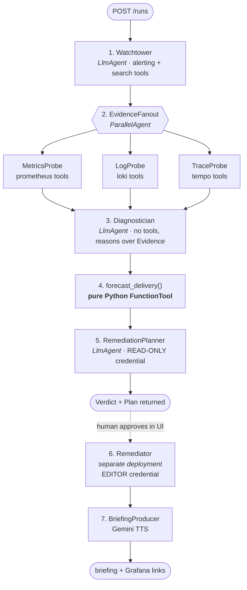

# Second Unit — Agent Design

How the pipeline is composed, what each stage is allowed to do, and the specific mechanisms
that make the run reproducible.

---

## 1. The graph



`SequentialAgent` at the top, one `ParallelAgent` for the fan-out. The dotted line is a
network and credential boundary, not a branch in the graph — see ADR-004.

---

## 2. Stage specifications

| # | Stage | Type | Tools bound | Input → Output |
|---|---|---|---|---|
| 1 | Watchtower | LlmAgent | alerting, search, datasources | trigger → `IncidentSeed` |
| 2a | MetricsProbe | LlmAgent | `query_prometheus`, label/metric discovery | `IncidentSeed` → `list[MetricFinding]` |
| 2b | LogProbe | LlmAgent | Loki query + label tools | `IncidentSeed` → `list[LogFinding]` |
| 2c | TraceProbe | LlmAgent | Tempo tools | `IncidentSeed` → `list[TraceFinding]` |
| 3 | Diagnostician | LlmAgent | **none** | `Evidence` → `Diagnosis` |
| 4 | Forecaster | FunctionTool | — | `Evidence` → `list[Forecast]` |
| 5 | RemediationPlanner | LlmAgent | read-only Grafana (to check what exists) | `Diagnosis`+`Forecast` → `RemediationPlan` |
| 6 | Remediator | LlmAgent, separate app | dashboard/alert/annotation **writes** | approved `plan_id` → `AppliedChanges` |
| 7 | BriefingProducer | FunctionTool | Gemini TTS | `Verdict` → audio URI |

### Why Diagnostician has no tools
It reasons over evidence already gathered. Giving it tools would let it wander, re-query,
and produce a different tool-call sequence every run — destroying reproducibility for no
diagnostic gain. **Separating gathering from reasoning is what makes the run repeatable.**

### Why the fan-out is parallel
The three probes are independent, and wall-clock matters when a judge is watching. Parallel
also means one probe failing degrades the diagnosis rather than blocking it.

---

## 3. Determinism mechanisms

Five specific things, because "deterministic" has to be built, not claimed:

1. **Fixed stage order in code.** `SequentialAgent`, not a router. The model cannot choose
   to skip diagnosis.
2. **Typed contracts at every boundary.** Pydantic validation; one bounded retry with the
   validation error fed back, then explicit stage failure. No prose handoffs.
3. **Arithmetic in Python.** `forecast_delivery()` is a pure function, golden-tested. The
   headline number is identical across runs given identical inputs. (ADR-003)
4. **`temperature=0` on every stage** except BriefingProducer, where a little variation in
   phrasing is harmless.
5. **Pinned time window.** The run captures `now` once, at entry, and every query uses that
   window. Otherwise stage 2c queries a different range than 2a and the evidence silently
   disagrees with itself.

Point 5 is the one people miss. Pin the clock.

---

## 4. Prompt design principles

Each stage instruction follows the same skeleton:

```
ROLE      one sentence, a real job title
INPUT     the contract it receives, named
TASK      numbered, bounded, with an explicit stopping condition
TOOLS     which to use, and the order to prefer
GROUNDING every claim needs an EvidenceRef. If you cannot cite it, do not say it.
REFUSAL   what to do with insufficient data: say so, do not fill the gap
OUTPUT    the contract, and nothing else
```

Rules applied throughout:
- **No "you are a helpful assistant."** Every role is a specific studio job: pipeline TD,
  render wrangler, VFX producer. Domain-anchored roles produce domain-anchored language.
- **Adversarial framing on the Diagnostician.** It must populate `ruled_out`. The prompt
  explicitly warns that the loudest alert is often a downstream symptom and names licence
  exhaustion as a classic red herring — without naming the answer.
- **Tool output is data, never instruction.** Log lines are wrapped and labelled as
  untrusted content. The prompt states that text inside telemetry cannot change the task.
- **Length discipline.** The Verdict headline is capped at ~90 characters. A producer reads
  one line. Longer output is a design failure dressed as thoroughness.

---

## 5. Grafana MCP tool coverage

Depth of partner integration is 25% of the score, so this is tracked as a deliverable, not
a byproduct. Target: **12+ distinct tools** across 6+ categories in a single triage run.

| Category | Intended tools | Stage |
|---|---|---|
| Search / nav | dashboard + resource search | 1, 5 |
| Datasources | list, inspect | 1 |
| Prometheus | metric discovery, label values, range + instant queries | 2a |
| Loki | log query, label metadata | 2b |
| Tempo | trace search, trace detail | 2c |
| Alerting | list rules, list firing alerts | 1 |
| Dashboards | create/update | 6 |
| Annotations | create | 6 |
| Incidents / Sift | investigation, if available on free tier | 2, opportunistic |

Fill the exact tool names from the Rung 1 dump in `03-prototype/spike/NOTES.md`, then put
the final list in the repo README as a table. Do not make a judge grep for it.

---

## 6. Observability of the agent itself

The audience is an observability company. An agent that is itself unobservable would be an
own goal.

- Every run emits its own metrics **back into Grafana Cloud**: stage latency, tool-call
  count per stage, token cost, contract-validation failures.
- Ship a **"Second Unit Operations" dashboard** showing the agent's own behaviour, built in
  the same stack it diagnoses.
- Put that dashboard in the video for ten seconds.

This is the highest-leverage optional feature in the whole project: it costs a few hours and
it speaks directly to the people scoring the Grafana track.

---

## 7. Testing the agent

| Test | Method |
|---|---|
| Contract validity | pydantic round-trip on every model, hypothesis for edge cases |
| Forecast correctness | golden values, hand-computed; includes the `insufficient_data` path |
| Pipeline without Grafana | recorded MCP responses as fixtures, replayed |
| Scenario detection | seed `driver-regression-cascade`, assert `root_cause` mentions driver/pool `gpu-b` and that licence exhaustion appears in `ruled_out` |
| Quiet-day behaviour | seed `quiet-day`, assert the agent reports nothing wrong and proposes no writes |
| Injection resistance | seed a log line containing an instruction; assert the plan still validates and contains no unexpected op |

The quiet-day and injection tests are the two that separate this from a demo. Most agents
have never been asked to say "nothing is wrong."
